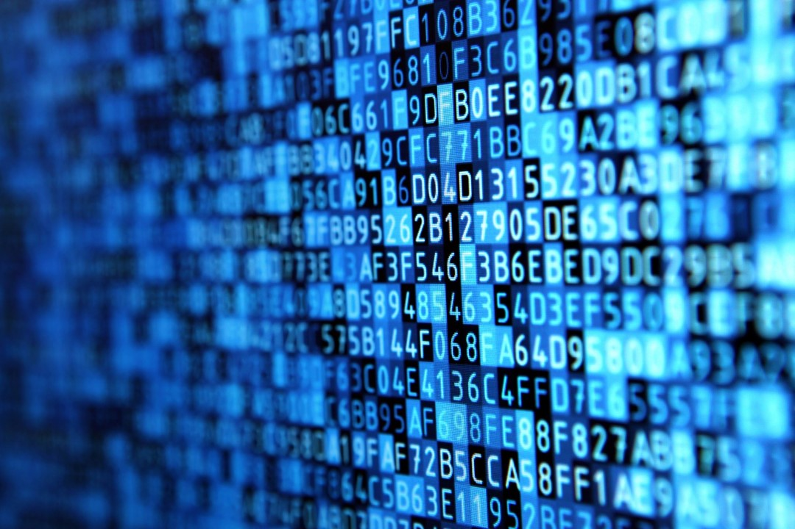

# **What is Data Science**

"What is Data Science?" is a straight forward question, but the answers can often be over complicated. 

Firstly, *what is data?*. A good way to understand something is to look at the origin, when did 'data' come into existence? 
Data is essentially the information of things. From people could first write, that was data being recorded. You remebering what you need to buy at the grocery story is data storage. 
To way before all these things, the colour of a plant is data, the height of grass is data. 

Data is in our everyday lives, and it alwasy has been, its only been since the turn of the centruy its place in society has began to valued more. 

Secondly, *what is science?*. Science is the study of things. The Science council defines science as "the pursuit and application of knowledge and understanding of the natural and social world following a systematic methodology based on evidence.". At the foundation of this pursuit and application of knowledge is information, i.e data. 

In summary, **data** is any information that can be measured and quantified. The legnth of a persons hair, their age, their wealth, their eye colour etc.. 
It plays a big part in our lives, as the world has growing since the turn of the 19th century information has grown exponentially so data has become ever so relevant as we have also grown in knoeledge. 
